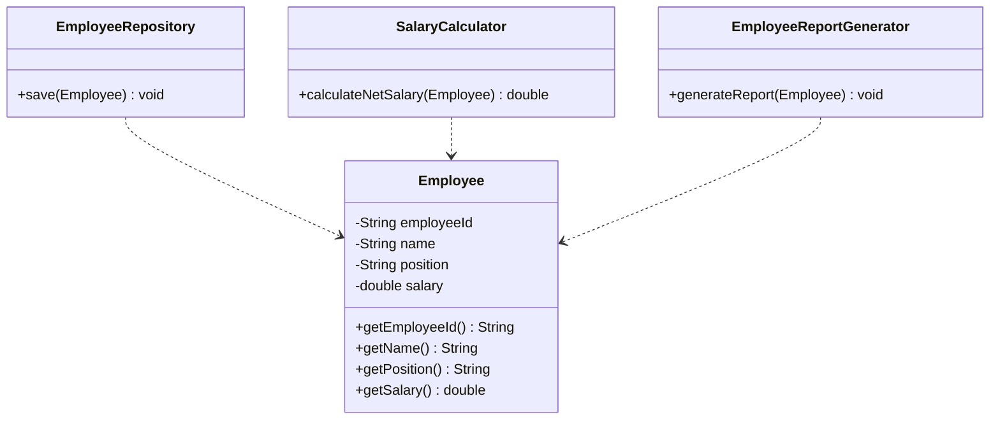

# Single Responsibility Principle (SRP)

## Definition
The Single Responsibility Principle states that a class should have only one reason to change, meaning it should have only one job or responsibility.

## Key Points
- Each class should focus on doing one thing well
- A class should have only one reason to change
- Helps maintain cleaner, more maintainable code
- Reduces coupling between different functionalities

## Example Implementation
The example in this directory demonstrates:
- A bad implementation where a class handles multiple responsibilities
- A better implementation where responsibilities are properly separated

## Class Diagram

## Benefits
1. Easier to understand and maintain
2. More reusable components
3. Easier to test
4. More flexible and adaptable code
5. Reduced ripple effects when changes are needed

## Cons/Challenges
1. Can lead to an explosion of classes in the system
2. Sometimes it's difficult to determine what constitutes a single responsibility
3. May result in increased complexity due to the number of classes
4. Can lead to over-engineering if taken to extreme
5. Requires more initial design time and effort
6. May increase the overhead of managing multiple classes
