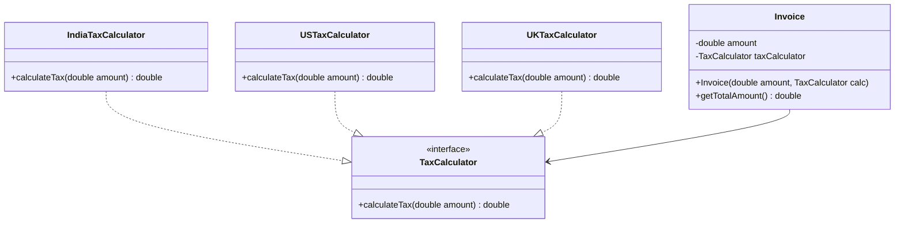

# Open-Closed Principle (OCP)

## Definition
The Open-Closed Principle states that software entities (classes, modules, functions, etc.) should be open for extension but closed for modification.

## Key Points
- Existing code should not be modified when adding new functionality
- New features should be added by extending existing code
- Use abstractions and interfaces to allow for extensibility
- Promotes use of inheritance and polymorphism

## Example Implementation
The example in this directory shows:
- A bad implementation where adding new features requires modifying existing code
- A better implementation that allows adding features through extension

## Class Diagram

## Benefits
1. Reduces risk of breaking existing functionality
2. Makes codebase more maintainable
3. Promotes code reusability
4. Easier to test new functionality
5. More flexible architecture

## Cons/Challenges
1. Can lead to increased complexity through abstraction layers
2. May require more initial planning and design effort
3. Can result in a larger number of classes and interfaces
4. Might introduce unnecessary abstraction if future changes are not anticipated correctly
5. Can make the code harder to understand for new developers
6. May increase development time for simple features that don't need extensibility
