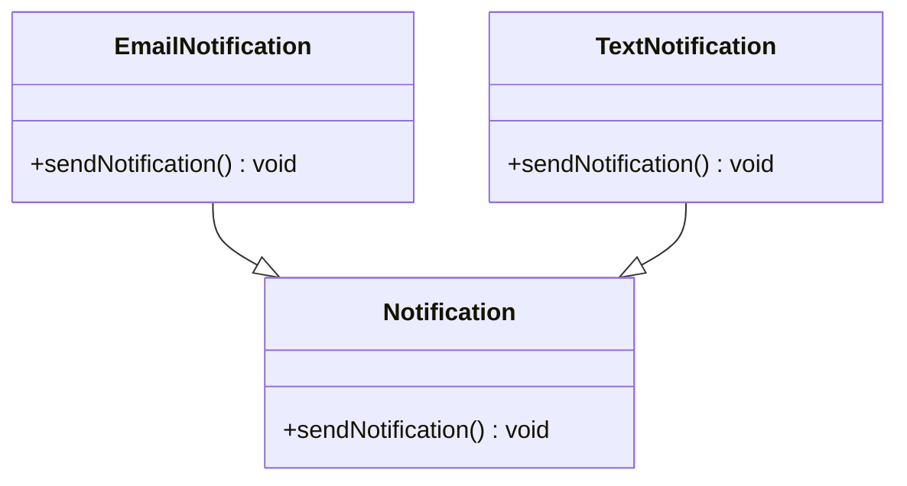

# Liskov Substitution Principle (LSP)

## Definition
The Liskov Substitution Principle states that objects of a superclass should be replaceable with objects of its subclasses without affecting the correctness of the program.

## Key Points
- Subtypes must be substitutable for their base types
- Derived classes must honor the contracts of base classes
- Inheritance should guarantee that any property proved about supertype objects also holds for subtype objects
- Prevents unexpected behavior when using inheritance

## Example Implementation
The example in this directory demonstrates:
- A bad implementation where LSP is violated
- A better implementation that properly follows LSP

## Class Diagram

## Benefits
1. More predictable behavior in inheritance hierarchies
2. Better code reusability
3. Improved system robustness
4. Easier maintenance
5. Better object-oriented design

## Cons/Challenges
1. Can be difficult to identify LSP violations during design phase
2. May require deep understanding of the domain to properly model inheritance
3. Sometimes leads to creation of parallel class hierarchies
4. Can result in more complex interfaces to ensure proper substitution
5. May require significant refactoring of existing code to comply
6. Can be challenging to maintain LSP when requirements change
