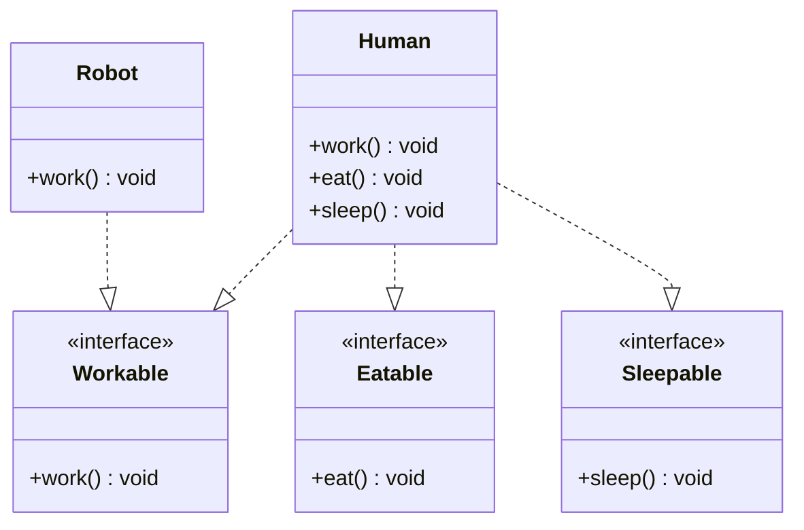

# Interface Segregation Principle (ISP)

## Definition
The Interface Segregation Principle states that clients should not be forced to depend on interfaces they don't use. In other words, it's better to have many smaller interfaces than a few larger ones.

## Key Points
- Keep interfaces small and focused
- Don't force classes to implement methods they don't need
- Split large interfaces into smaller ones
- Clients should only know about methods that are relevant to them

## Example Implementation
The example in this directory shows:
- A bad implementation with a large, monolithic interface
- A better implementation with segregated, focused interfaces

## Class Diagram

## Benefits
1. More cohesive code organization
2. Reduced coupling between components
3. Easier to maintain and modify
4. Better code reusability
5. More flexible and adaptable design

## Cons/Challenges
1. Can lead to a proliferation of interfaces
2. May increase the complexity of the codebase
3. More interfaces to manage and maintain
4. Can make the code structure harder to understand initially
5. Requires careful consideration of interface boundaries
6. May require frequent refactoring as requirements change
