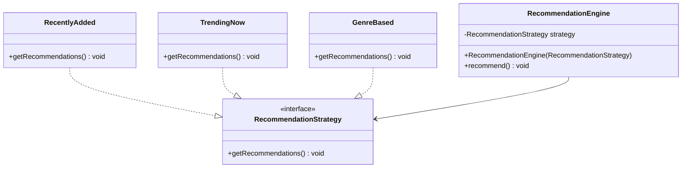

# Dependency Inversion Principle (DIP)

## Definition
The Dependency Inversion Principle states that high-level modules should not depend on low-level modules; both should depend on abstractions. Additionally, abstractions should not depend on details; details should depend on abstractions.

## Key Points
- Depend on abstractions rather than concrete implementations
- High-level modules should be independent of low-level module implementation details
- Use interfaces or abstract classes to define contracts
- Promotes loose coupling between components

## Example Implementation
The example in this directory demonstrates:
- A bad implementation with tight coupling between modules
- A better implementation using dependency inversion through abstractions

## Class Diagram

## Benefits
1. Reduced coupling between modules
2. Easier to modify implementations
3. Better testability through dependency injection
4. More flexible architecture
5. Easier to maintain and evolve the system

## Common Implementations
- Dependency Injection
- Factory Pattern
- Service Locator Pattern

## Cons/Challenges
1. Can increase system complexity due to additional abstraction layers
2. May require more planning and initial setup
3. Can be overkill for simple applications
4. Requires careful consideration of abstraction boundaries
5. May need additional infrastructure (DI containers)
6. Learning curve for new developers
7. Can make debugging more challenging due to indirection
