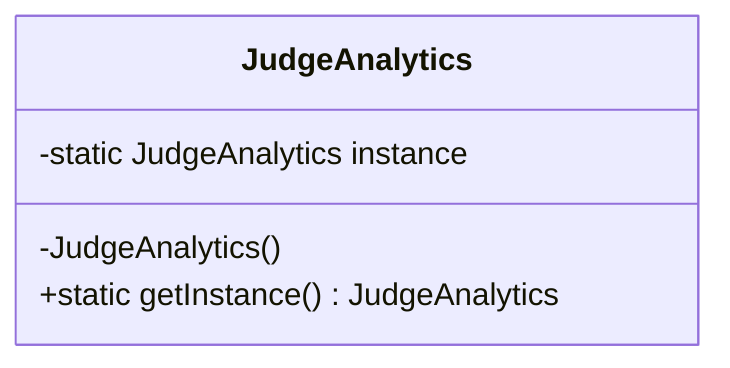

# Singleton Design Pattern

## Definition
The Singleton Pattern ensures that a class has only one instance and provides a global point of access to that instance. It's one of the simplest design patterns but can be tricky to implement correctly, especially in multi-threaded environments.

## Key Points
1. Private constructor to prevent direct instantiation
2. Private static instance of the class
3. Public static method to get the instance
4. Thread safety considerations
5. Initialization strategies (eager vs lazy)

## Example Implementation
In our example, we implement a thread-safe Singleton for a `JudgeAnalytics` class:

```java
class JudgeAnalytics {
    private static final JudgeAnalytics instance = new JudgeAnalytics();

    private JudgeAnalytics() {
        // Private constructor to prevent instantiation
    }

    public static JudgeAnalytics getInstance() {
        return instance;
    }
}
```

## Class Diagram based on the implementation in Main.java


## Benefits
1. **Controlled Access**: Single point of access to the instance
2. **Reduced Memory**: Only one instance is created
3. **Flexibility**: Easy to implement variations
4. **Global State**: Provides a global state in the application
5. **Thread Safety**: Can be made thread-safe with proper implementation

## Cons/Challenges
1. **Global State**: Can make code harder to test
2. **Thread Safety**: Requires careful implementation in multi-threaded environments
3. **Tight Coupling**: Classes depending on Singleton are tightly coupled
4. **Testing Difficulty**: Hard to mock for unit testing
5. **Violation of SRP**: Class manages its own lifecycle and business logic

## Implementation Variations
1. **Eager Initialization**:
   ```java
   private static final JudgeAnalytics instance = new JudgeAnalytics();
   ```

2. **Lazy Initialization with Double-Check Locking**:
   ```java
   private static volatile JudgeAnalytics instance;
   public static JudgeAnalytics getInstance() {
       if (instance == null) {
           synchronized (JudgeAnalytics.class) {
               if (instance == null) {
                   instance = new JudgeAnalytics();
               }
           }
       }
       return instance;
   }
   ```

3. **Bill Pugh Singleton Implementation**:
   ```java
   private static class SingletonHolder {
       private static final JudgeAnalytics INSTANCE = new JudgeAnalytics();
   }
   public static JudgeAnalytics getInstance() {
       return SingletonHolder.INSTANCE;
   }
   ```
