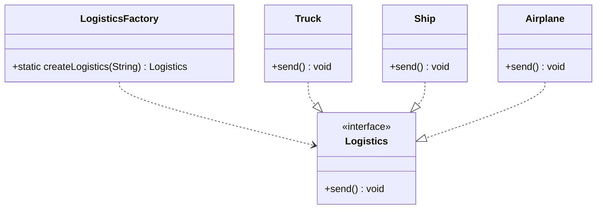

# Factory Method Pattern

## Definition
The Factory Method Pattern defines an interface for creating objects but lets subclasses decide which class to instantiate. It enables a class to defer instantiation to subclasses, promoting loose coupling and encapsulation.

## Key Points
1. Defines an interface for creating objects
2. Lets subclasses alter the type of objects being created
3. Promotes loose coupling through abstraction
4. Encapsulates object creation logic
5. Follows the Open-Closed Principle

## Example Implementation
In our example, we implement a logistics management system:

```java
interface Logistics {
    void send();
}

class LogisticsFactory {
    public static Logistics createLogistics(String mode) {
        switch (mode) {
            case "Truck" -> return new Truck();
            case "Ship" -> return new Ship();
            case "Airplane" -> return new Airplane();
            default -> throw new IllegalArgumentException("Unknown mode: " + mode);
        }
    }
}
```

## Class Diagram based on the implementation in Main.java


## Benefits
1. **Loose Coupling**: Factory separates product creation from its use
2. **Single Responsibility**: Creation logic is centralized
3. **Open/Closed**: Easy to add new product types
4. **Flexibility**: Runtime decision making for object creation
5. **Encapsulation**: Complex creation logic is hidden

## Cons/Challenges
1. **Complexity**: Can lead to many subclasses
2. **Refactoring**: May require significant changes to existing code
3. **Type Safety**: Runtime errors possible with wrong type strings
4. **Maintenance**: Must maintain parallel hierarchies
5. **Overhead**: Additional classes and interfaces needed

## Common Use Cases
1. **Framework Libraries**: When creating objects based on conditions
2. **Plugin Architectures**: For extensible applications
3. **Different Object Variants**: When objects share an interface but have different implementations
4. **Cross-Platform UI**: Creating appropriate UI components
5. **File Format Handlers**: Creating appropriate handlers for different file types
