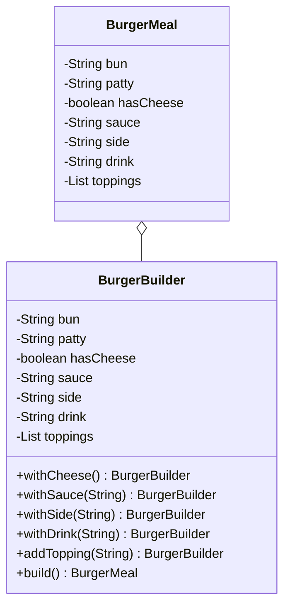

# Builder Pattern

## Definition
The Builder Pattern separates the construction of a complex object from its representation, allowing the same construction process to create different representations. It's particularly useful when you need to create an object with numerous possible configurations.

## Key Points
1. Separates construction from representation
2. Step-by-step object construction
3. Fluent interface (method chaining)
4. Handles optional parameters elegantly
5. Creates immutable objects safely

## Example Implementation
In our example, we implement a BurgerMeal builder:

```java
public class BurgerMeal {
    private final String bun;
    private final String patty;
    private final boolean hasCheese;
    private final String sauce;
    private final String side;
    private final String drink;
    private final List<String> toppings;

    public static class BurgerBuilder {
        // Required parameters
        private final String bun;
        private final String patty;

        // Optional parameters with defaults
        private boolean hasCheese = false;
        private String sauce = "";
        private String side = "";
        private String drink = "";
        private List<String> toppings = new ArrayList<>();

        public BurgerBuilder(String bun, String patty) {
            this.bun = bun;
            this.patty = patty;
        }

        public BurgerBuilder withCheese() {
            this.hasCheese = true;
            return this;
        }

        // Other builder methods...

        public BurgerMeal build() {
            return new BurgerMeal(this);
        }
    }
}
```

## Class Diagram based on the implementation in Main.java


## Benefits
1. **Clear Separation**: Construction code separate from business logic
2. **Flexible Construction**: Step-by-step creation with different representations
3. **Immutable Objects**: Safe creation of immutable objects
4. **Parameter Control**: Better handling of optional parameters
5. **Fluent Interface**: Readable method chaining

## Cons/Challenges
1. **Code Volume**: More code needed compared to constructors
2. **Multiple Classes**: Requires separate builder classes
3. **Complexity**: Can be overkill for simple objects
4. **Mutability Concern**: Builder must be mutable
5. **Performance**: Slight overhead from creating builder objects

## When to Use
1. **Complex Objects**: Objects with many optional parameters
2. **Immutable Objects**: Creating immutable objects with many fields
3. **Object Variants**: Different representations of same object
4. **Clear Construction**: When construction process needs to be clear
5. **Parameter Combinations**: Many parameter combinations possible

## Best Practices
1. Make the product class immutable
2. Use clear, descriptive builder method names
3. Validate parameters in the build method
4. Consider making builder inner class of product
5. Use required parameters in builder constructor
6. Return builder instance for method chaining
