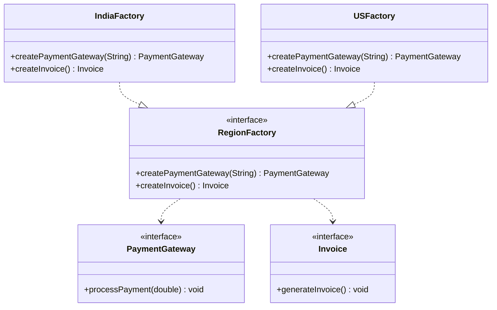

# Abstract Factory Pattern

## Definition
The Abstract Factory Pattern provides an interface for creating families of related or dependent objects without specifying their concrete classes. It's a higher-level pattern that encapsulates a group of individual factories that have a common theme.

## Key Points
1. Creates families of related objects
2. Works with interfaces, not implementations
3. Promotes consistency among products
4. Supports multiple product variants
5. Follows both Open-Closed and Dependency Inversion Principles

## Example Implementation
In our example, we implement a cross-region payment processing system:

```java
interface RegionFactory {
    PaymentGateway createPaymentGateway(String type);
    Invoice createInvoice();
}

class IndiaFactory implements RegionFactory {
    @Override
    public PaymentGateway createPaymentGateway(String type) {
        if (type.equals("Razorpay")) return new RazorpayGateway();
        else if (type.equals("PayU")) return new PayUGateway();
        else throw new IllegalArgumentException("Unknown payment gateway: " + type);
    }

    @Override
    public Invoice createInvoice() {
        return new GSTInvoice();
    }
}
```

## Class Diagram based on the implementation in Main.java


## Benefits
1. **Product Consistency**: Ensures compatible objects are used together
2. **Isolation**: Isolates concrete classes from client
3. **Easy Product Family Change**: Switch entire product family easily
4. **Promotes SRP**: Each factory handles one product family
5. **Flexibility**: Easy to add new variants

## Cons/Challenges
1. **Complexity**: More complex than Factory Method
2. **Many Interfaces**: Can lead to interface proliferation
3. **Hard to Add Products**: Adding new product types requires modifying interfaces
4. **Code Duplication**: Similar code across concrete factories
5. **Initial Design**: Requires careful upfront design

## Use Cases
1. **Cross-Platform UI Toolkits**: Different UI components for different platforms
2. **Multiple Database Support**: Creating DB-specific components
3. **Regional Systems**: Region-specific implementations
4. **Theme Systems**: Creating themed UI components
5. **Plugin Architectures**: Creating plugin-specific components

## Implementation Tips
1. Start with product interfaces
2. Define factory interface
3. Create concrete factories
4. Use dependency injection
5. Consider using with other patterns like Singleton
