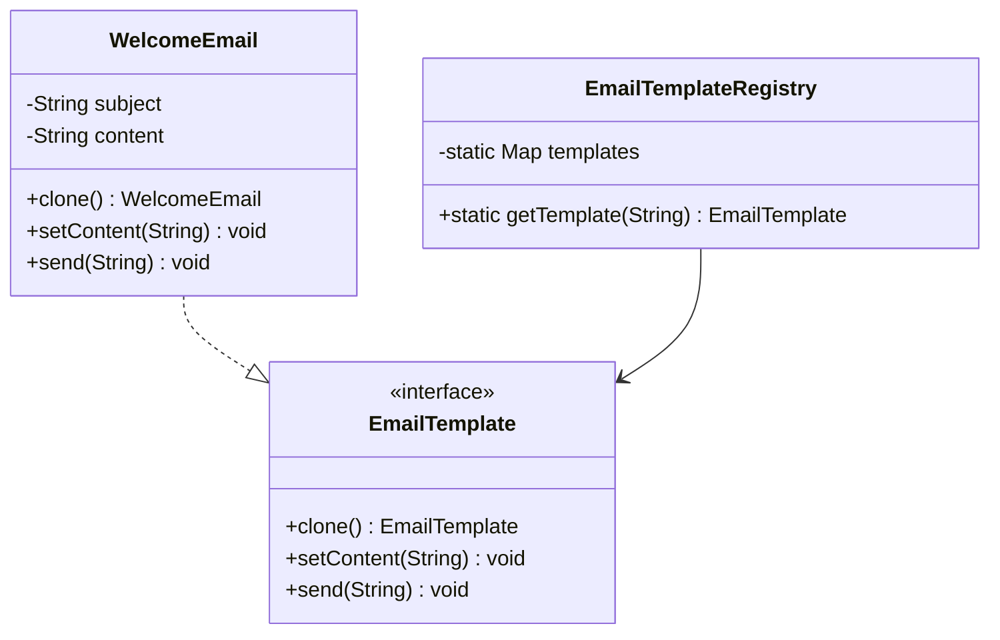

# Prototype Pattern

## Definition
The Prototype Pattern creates new objects by cloning an existing object, known as the prototype. This pattern is used when the cost of creating an object is more expensive than copying an existing one or when you need to create multiple variations of complex objects.

## Key Points
1. Clone existing objects instead of creating new ones
2. Avoid expensive object creation
3. Create objects with varying configurations
4. Hide complexity of object creation
5. Support deep and shallow copying

## Example Implementation
In our example, we implement an email template system:

```java
interface EmailTemplate extends Cloneable {
    EmailTemplate clone();
    void setContent(String content);
    void send(String to);
}

class WelcomeEmail implements EmailTemplate {
    private String subject;
    private String content;

    public WelcomeEmail() {
        this.subject = "Welcome to TUF+";
        this.content = "Hi there! Thanks for joining us.";
    }

    @Override
    public WelcomeEmail clone() {
        try {
            return (WelcomeEmail) super.clone();
        } catch (CloneNotSupportedException e) {
            throw new RuntimeException("Clone failed", e);
        }
    }
}
```

## Class Diagram based on the implementation in Main.java


## Benefits
1. **Performance**: Avoid expensive object creation
2. **Flexibility**: Easy to create object variations
3. **Consistency**: Clone ensures valid object state
4. **Dynamic Creation**: Add/remove prototypes at runtime
5. **Reduced Subclassing**: Alternative to factory pattern

## Cons/Challenges
1. **Cloning Complexity**: Deep vs shallow copy decisions
2. **Circular References**: Can be problematic when cloning
3. **Clone Method**: Must implement properly
4. **Initialization**: Managing prototype initialization
5. **Type Safety**: Type casting may be needed

## Use Cases
1. **Document Templates**: Creating variations of standard documents
2. **UI Components**: Cloning complex UI elements
3. **Game Objects**: Creating multiple instances of similar game entities
4. **Configuration Objects**: Creating variations of default configurations
5. **Cache Systems**: Creating copies of cached objects

## Implementation Considerations
1. **Cloning Method**:
   ```java
   @Override
   public Object clone() {
       try {
           return super.clone();
       } catch (CloneNotSupportedException e) {
           return null;
       }
   }
   ```

2. **Deep Cloning**:
   ```java
   @Override
   public Object clone() {
       Object clone = super.clone();
       // Deep copy mutable fields
       return clone;
   }
   ```

3. **Registry Implementation**:
   ```java
   class PrototypeRegistry {
       private Map<String, Prototype> items = new HashMap<>();
       
       public void addItem(String key, Prototype p) {
           items.put(key, p);
       }
       
       public Prototype getItem(String key) {
           return items.get(key).clone();
       }
   }
   ```
