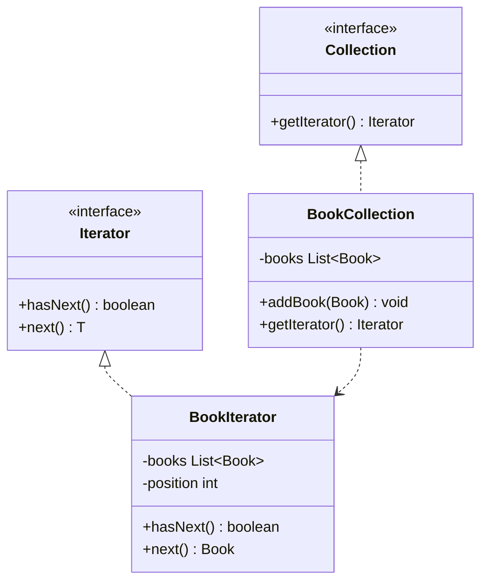

# Iterator Design Pattern

## Definition
The Iterator Pattern provides a way to access elements of an aggregate object sequentially without exposing its underlying representation. It encapsulates the traversal of a collection and provides a uniform interface to traverse different collections.

## Key Points
1. Provides a uniform interface for traversing different collections
2. Separates the traversal algorithm from the collection
3. Supports multiple concurrent traversals
4. Allows collections to have different interfaces
5. Simplifies the collection interface

## Example Implementation
```java
// Iterator interface
interface Iterator<T> {
    boolean hasNext();
    T next();
}

// Collection interface
interface Collection<T> {
    Iterator<T> getIterator();
}

// Concrete Iterator
class BookIterator implements Iterator<Book> {
    private List<Book> books;
    private int position = 0;

    public BookIterator(List<Book> books) {
        this.books = books;
    }

    public boolean hasNext() {
        return position < books.size();
    }

    public Book next() {
        if (hasNext()) {
            return books.get(position++);
        }
        return null;
    }
}

// Concrete Collection
class BookCollection implements Collection<Book> {
    private List<Book> books = new ArrayList<>();

    public void addBook(Book book) {
        books.add(book);
    }

    public Iterator<Book> getIterator() {
        return new BookIterator(books);
    }
}
```

## Class Diagram


## Benefits
1. **Single Responsibility**: Separates collection traversal from collection implementation
2. **Open/Closed**: New types of collections and iterators can be added easily
3. **Parallel Iteration**: Multiple iterators can traverse the same collection simultaneously
4. **Clean Interface**: Collections have simpler interfaces without traversal methods
5. **Flexibility**: Different traversal algorithms can be implemented independently

## Cons/Challenges
1. **Overhead**: May be overkill for simple collections
2. **Complexity**: Adds additional classes and interfaces
3. **State Management**: Iterator must maintain traversal state
4. **Limited Access**: Some iterator implementations might limit collection modifications during iteration
5. **Memory Usage**: Storing iteration state can consume memory in large collections
