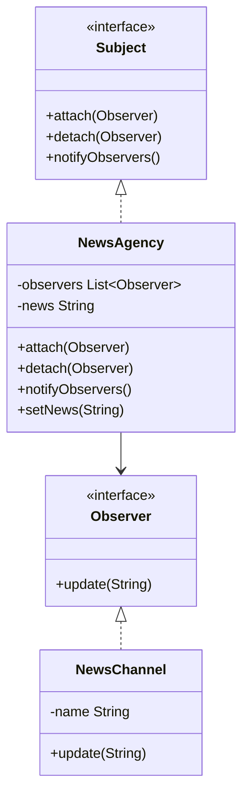

# Observer Design Pattern

## Definition
The Observer Pattern defines a one-to-many dependency between objects where a change in one object (the subject/observable) results in automatic notification and updates to other objects (the observers). This pattern is also known as the Publish-Subscribe pattern.

## Key Points
1. Subject maintains a list of observers
2. Observers can subscribe and unsubscribe
3. Subject notifies all observers of state changes
4. Loose coupling between subject and observers
5. Support for broadcast communication

## Example Implementation
```java
// Observer interface
interface Observer {
    void update(String message);
}

// Subject interface
interface Subject {
    void attach(Observer observer);
    void detach(Observer observer);
    void notifyObservers();
}

// Concrete Subject
class NewsAgency implements Subject {
    private List<Observer> observers = new ArrayList<>();
    private String news;

    public void attach(Observer observer) {
        observers.add(observer);
    }

    public void detach(Observer observer) {
        observers.remove(observer);
    }

    public void notifyObservers() {
        for (Observer observer : observers) {
            observer.update(news);
        }
    }

    public void setNews(String news) {
        this.news = news;
        notifyObservers();
    }
}

// Concrete Observer
class NewsChannel implements Observer {
    private String name;

    public NewsChannel(String name) {
        this.name = name;
    }

    @Override
    public void update(String news) {
        System.out.println(name + " received news: " + news);
    }
}
```

## Class Diagram


## Benefits
1. **Loose Coupling**: Subjects and observers can vary independently
2. **Support for Broadcast**: One-to-many relationship between objects
3. **Dynamic Relationships**: Observers can be added/removed at runtime
4. **Reusability**: Subject and observer classes can be reused independently
5. **Maintainability**: Changes to subject don't affect observers and vice versa

## Cons/Challenges
1. **Memory Leaks**: If observers aren't properly unregistered
2. **Unexpected Updates**: Observers might be notified in an unexpected order
3. **Cascade of Updates**: One update might trigger a chain reaction
4. **Performance**: Large number of observers can impact performance
5. **Limited Control**: Observers don't know about each other's existence
