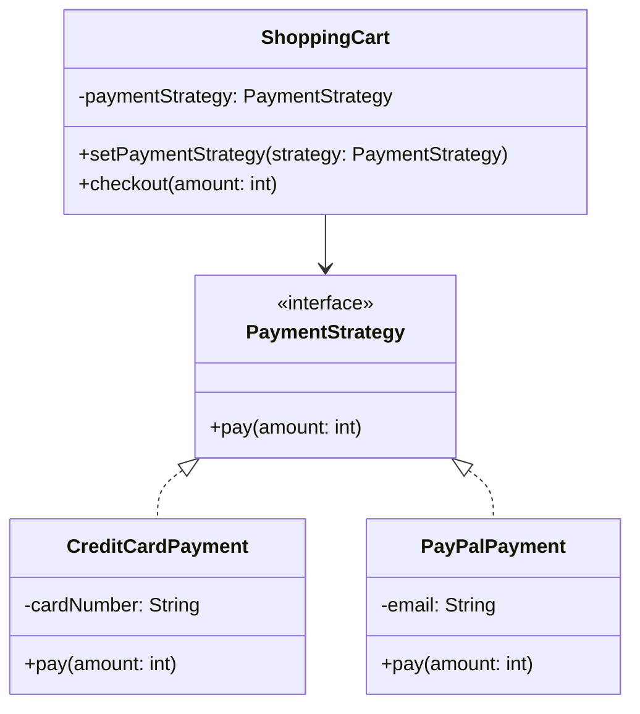

# Strategy Design Pattern

## Definition
The Strategy Pattern defines a family of algorithms, encapsulates each one, and makes them interchangeable. It lets the algorithm vary independently from clients that use it. This pattern enables selecting an algorithm's implementation at runtime.

## Key Points
1. Defines a family of interchangeable algorithms
2. Encapsulates each algorithm
3. Makes algorithms interchangeable within a family
4. Allows runtime algorithm selection
5. Promotes composition over inheritance

## Example Implementation
```java
// Strategy interface
interface PaymentStrategy {
    void pay(int amount);
}

// Concrete strategies
class CreditCardPayment implements PaymentStrategy {
    private String cardNumber;
    
    public CreditCardPayment(String cardNumber) {
        this.cardNumber = cardNumber;
    }
    
    @Override
    public void pay(int amount) {
        System.out.println("Paid " + amount + " using Credit Card: " + cardNumber);
    }
}

class PayPalPayment implements PaymentStrategy {
    private String email;
    
    public PayPalPayment(String email) {
        this.email = email;
    }
    
    @Override
    public void pay(int amount) {
        System.out.println("Paid " + amount + " using PayPal account: " + email);
    }
}

// Context
class ShoppingCart {
    private PaymentStrategy paymentStrategy;
    
    public void setPaymentStrategy(PaymentStrategy strategy) {
        this.paymentStrategy = strategy;
    }
    
    public void checkout(int amount) {
        paymentStrategy.pay(amount);
    }
}
```

## Class Diagram


## Benefits
1. **Algorithm Encapsulation**: Each strategy is isolated and self-contained
2. **Runtime Flexibility**: Algorithms can be switched at runtime
3. **Eliminates Conditionals**: Replaces complex conditional logic with strategy objects
4. **Maintenance**: Easy to add new strategies without changing existing code
5. **Reusability**: Strategies can be reused across different contexts

## Cons/Challenges
1. **Increased Number of Objects**: Creates additional strategy objects
2. **Client Awareness**: Clients must know about different strategies
3. **Communication Overhead**: Strategy and context objects need to interact
4. **Strategy Selection**: Client must choose appropriate strategy
5. **Configuration Complexity**: Setting up the right strategy can be complex
