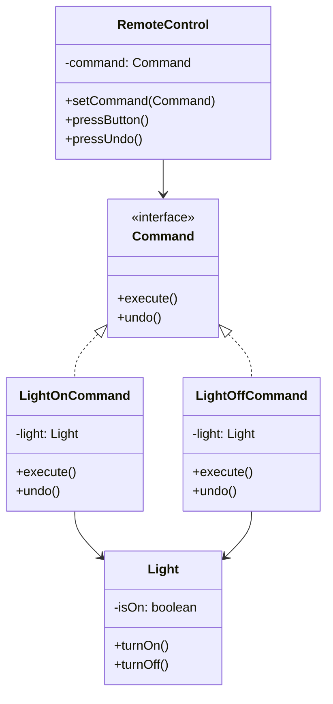

# Command Design Pattern

## Definition
The Command Pattern encapsulates a request as an object, thereby allowing you to parameterize clients with different requests, queue or log requests, and support undoable operations. It turns a request into a stand-alone object containing all information about the request.

## Key Points
1. Encapsulates request as an object
2. Decouples sender from processor
3. Supports undo/redo operations
4. Enables queueing of requests
5. Allows parameterization of clients

## Example Implementation
```java
// Command interface
interface Command {
    void execute();
    void undo();
}

// Receiver
class Light {
    private boolean isOn = false;
    
    public void turnOn() {
        isOn = true;
        System.out.println("Light is turned on");
    }
    
    public void turnOff() {
        isOn = false;
        System.out.println("Light is turned off");
    }
}

// Concrete Commands
class LightOnCommand implements Command {
    private Light light;
    
    public LightOnCommand(Light light) {
        this.light = light;
    }
    
    public void execute() {
        light.turnOn();
    }
    
    public void undo() {
        light.turnOff();
    }
}

class LightOffCommand implements Command {
    private Light light;
    
    public LightOffCommand(Light light) {
        this.light = light;
    }
    
    public void execute() {
        light.turnOff();
    }
    
    public void undo() {
        light.turnOn();
    }
}

// Invoker
class RemoteControl {
    private Command command;
    
    public void setCommand(Command command) {
        this.command = command;
    }
    
    public void pressButton() {
        command.execute();
    }
    
    public void pressUndo() {
        command.undo();
    }
}
```

## Class Diagram


## Benefits
1. **Decoupling**: Separates invoker from receiver
2. **Extensibility**: Easy to add new commands
3. **Composite Commands**: Can create macro commands
4. **Undo/Redo**: Supports reversible operations
5. **Queue & Log**: Can queue, log, and persist commands

## Cons/Challenges
1. **Class Explosion**: Many command classes for simple operations
2. **Complexity**: Can be overkill for simple applications
3. **Memory Usage**: Command objects may consume significant memory
4. **State Management**: Managing command history for undo/redo
5. **Synchronization**: Handling concurrent command execution
