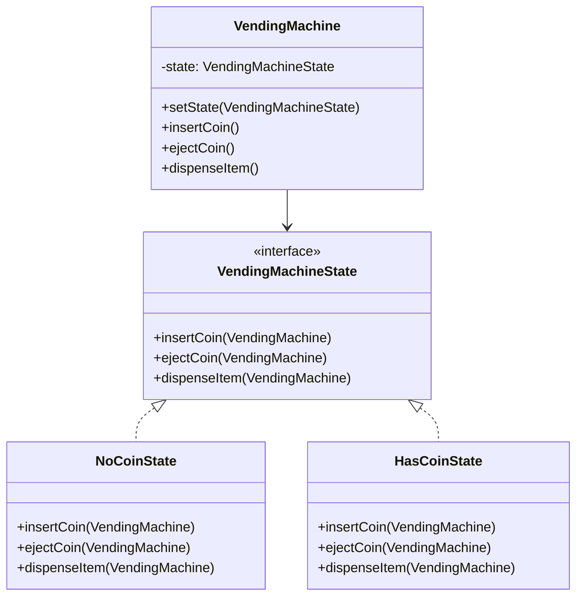

# State Design Pattern

## Definition
The State Pattern allows an object to alter its behavior when its internal state changes. The object will appear to change its class. It provides a way to encapsulate state-dependent behavior and make state transitions explicit.

## Key Points
1. Object behavior depends on its state
2. State transitions are explicit
3. State-specific behavior is localized
4. States can be added/modified independently
5. Eliminates large conditional statements

## Example Implementation
```java
// State interface
interface VendingMachineState {
    void insertCoin(VendingMachine machine);
    void ejectCoin(VendingMachine machine);
    void dispenseItem(VendingMachine machine);
}

// Concrete States
class NoCoinState implements VendingMachineState {
    public void insertCoin(VendingMachine machine) {
        System.out.println("Coin accepted");
        machine.setState(new HasCoinState());
    }
    
    public void ejectCoin(VendingMachine machine) {
        System.out.println("No coin to eject");
    }
    
    public void dispenseItem(VendingMachine machine) {
        System.out.println("Please insert a coin first");
    }
}

class HasCoinState implements VendingMachineState {
    public void insertCoin(VendingMachine machine) {
        System.out.println("Already has a coin");
    }
    
    public void ejectCoin(VendingMachine machine) {
        System.out.println("Coin ejected");
        machine.setState(new NoCoinState());
    }
    
    public void dispenseItem(VendingMachine machine) {
        System.out.println("Item dispensed");
        machine.setState(new NoCoinState());
    }
}

// Context
class VendingMachine {
    private VendingMachineState state;
    
    public VendingMachine() {
        state = new NoCoinState();
    }
    
    public void setState(VendingMachineState state) {
        this.state = state;
    }
    
    public void insertCoin() {
        state.insertCoin(this);
    }
    
    public void ejectCoin() {
        state.ejectCoin(this);
    }
    
    public void dispenseItem() {
        state.dispenseItem(this);
    }
}
```

## Class Diagram


## Benefits
1. **Single Responsibility**: Each state handles its own behavior
2. **Open/Closed**: New states can be added without changing existing states
3. **Eliminates Conditionals**: Replaces complex state-based conditionals
4. **State Transitions**: Makes state transitions explicit and clear
5. **State-specific Behavior**: Localizes state-specific behavior

## Cons/Challenges
1. **Increased Classes**: One class per state can lead to many classes
2. **State Transitions**: Managing transitions can become complex
3. **Shared State**: Handling shared state between states
4. **Context Coupling**: States are coupled to the context class
5. **Overhead**: Can be overkill for simple state management
