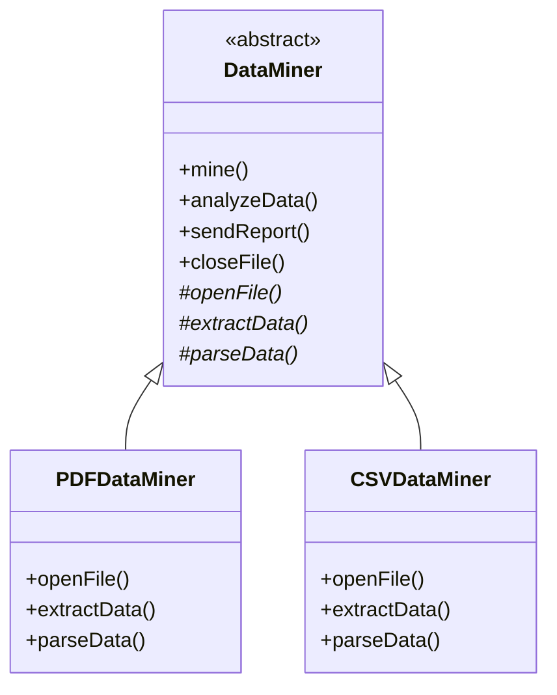

# Template Method Design Pattern

## Definition
The Template Method Pattern defines the skeleton of an algorithm in a base class but lets subclasses override specific steps of the algorithm without changing its structure. It defines the program skeleton in a method, deferring some steps to subclasses.

## Key Points
1. Defines algorithm skeleton in base class
2. Subclasses can override specific steps
3. Enforces algorithm structure
4. Promotes code reuse
5. Supports "Hollywood Principle"

## Example Implementation
```java
// Abstract class with template method
abstract class DataMiner {
    // Template method
    public final void mine() {
        openFile();
        extractData();
        parseData();
        analyzeData();
        sendReport();
        closeFile();
    }
    
    // Abstract methods to be implemented by subclasses
    abstract void openFile();
    abstract void extractData();
    abstract void parseData();
    
    // Concrete methods
    void analyzeData() {
        System.out.println("Analyzing data...");
    }
    
    void sendReport() {
        System.out.println("Sending report...");
    }
    
    void closeFile() {
        System.out.println("Closing file...");
    }
}

// Concrete implementations
class PDFDataMiner extends DataMiner {
    void openFile() {
        System.out.println("Opening PDF file...");
    }
    
    void extractData() {
        System.out.println("Extracting data from PDF...");
    }
    
    void parseData() {
        System.out.println("Parsing PDF data...");
    }
}

class CSVDataMiner extends DataMiner {
    void openFile() {
        System.out.println("Opening CSV file...");
    }
    
    void extractData() {
        System.out.println("Extracting data from CSV...");
    }
    
    void parseData() {
        System.out.println("Parsing CSV data...");
    }
}
```

## Class Diagram


## Benefits
1. **Code Reuse**: Common code is implemented in base class
2. **Flexibility**: Subclasses can override specific steps
3. **Maintainability**: Changes to algorithm structure affect only base class
4. **Control**: Base class controls algorithm flow
5. **Consistent Structure**: Enforces consistent implementation across subclasses

## Cons/Challenges
1. **Rigid Structure**: Algorithm steps are fixed
2. **Limited Flexibility**: Subclasses can only override certain steps
3. **Understanding**: Can be hard to understand the complete algorithm flow
4. **Maintenance**: Changes to template method affect all subclasses
5. **Violation of LSP**: Subclasses might violate Liskov Substitution Principle
