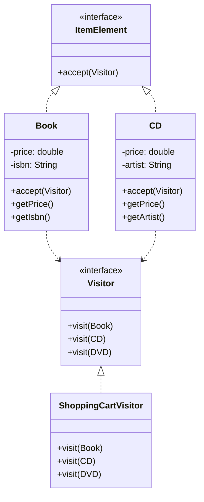

# Visitor Design Pattern

## Definition
The Visitor Pattern represents an operation to be performed on the elements of an object structure. It lets you define a new operation without changing the classes of the elements on which it operates, effectively separating an algorithm from the objects on which it operates.

## Key Points
1. Separates algorithm from object structure
2. Allows adding new operations easily
3. Gathers related operations into a visitor
4. Enables double dispatch
5. Maintains Open/Closed Principle

## Example Implementation
```java
// Visitor interface
interface Visitor {
    void visit(Book book);
    void visit(CD cd);
    void visit(DVD dvd);
}

// Element interface
interface ItemElement {
    void accept(Visitor visitor);
}

// Concrete elements
class Book implements ItemElement {
    private double price;
    private String isbn;
    
    public Book(double price, String isbn) {
        this.price = price;
        this.isbn = isbn;
    }
    
    public double getPrice() {
        return price;
    }
    
    public String getIsbn() {
        return isbn;
    }
    
    @Override
    public void accept(Visitor visitor) {
        visitor.visit(this);
    }
}

class CD implements ItemElement {
    private double price;
    private String artist;
    
    public CD(double price, String artist) {
        this.price = price;
        this.artist = artist;
    }
    
    public double getPrice() {
        return price;
    }
    
    public String getArtist() {
        return artist;
    }
    
    @Override
    public void accept(Visitor visitor) {
        visitor.visit(this);
    }
}

// Concrete visitor
class ShoppingCartVisitor implements Visitor {
    @Override
    public void visit(Book book) {
        double cost = book.getPrice();
        if(book.getPrice() > 50) {
            cost = cost - 5;
        }
        System.out.println("Book ISBN: " + book.getIsbn() + " cost = " + cost);
    }
    
    @Override
    public void visit(CD cd) {
        double cost = cd.getPrice();
        System.out.println("CD Artist: " + cd.getArtist() + " cost = " + cost);
    }
    
    @Override
    public void visit(DVD dvd) {
        double cost = dvd.getPrice();
        System.out.println("DVD Title: " + dvd.getTitle() + " cost = " + cost);
    }
}
```

## Class Diagram


## Benefits
1. **Separation of Concerns**: Separates algorithm from object structure
2. **Adding Operations**: Easy to add new operations
3. **Related Operations**: Groups related operations in one class
4. **No Modification**: Object structure remains unchanged
5. **Type Safety**: Compile-time type checking

## Cons/Challenges
1. **Adding Elements**: Difficult to add new concrete elements
2. **Interface Pollution**: Elements must expose internal details
3. **Breaking Encapsulation**: Visitors need access to element internals
4. **Complex Implementation**: Double dispatch can be confusing
5. **Maintenance**: Changes to element interface affect all visitors
