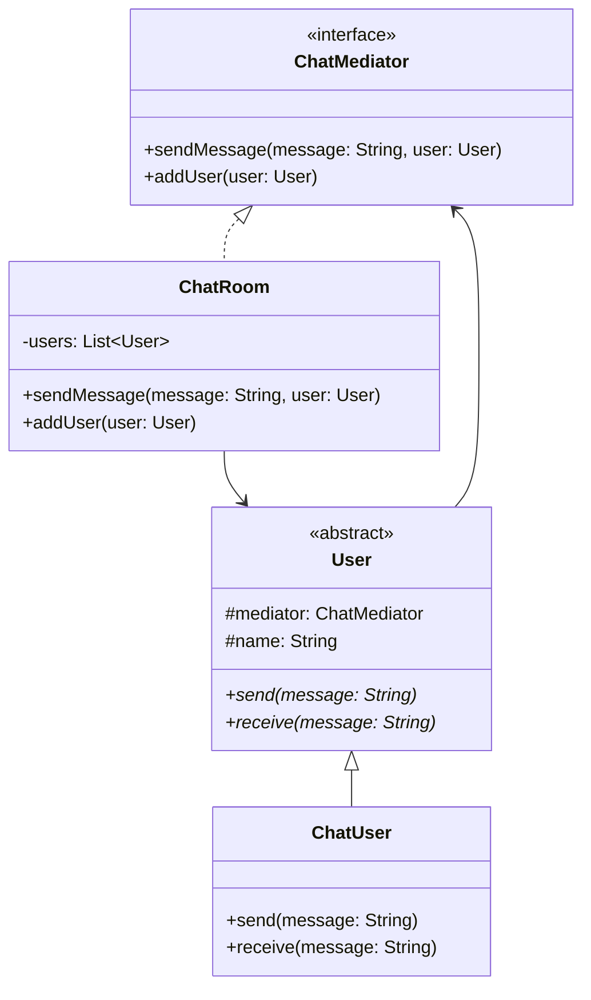

# Mediator Design Pattern

## Definition
The Mediator Pattern defines an object that encapsulates how a set of objects interact. It promotes loose coupling by keeping objects from referring to each other explicitly, and lets you vary their interaction independently.

## Key Points
1. Centralizes complex communications
2. Reduces coupling between components
3. Simplifies object protocols
4. Eases maintenance and modifications
5. Enables reuse of individual components

## Example Implementation
```java
// Mediator interface
interface ChatMediator {
    void sendMessage(String message, User user);
    void addUser(User user);
}

// Abstract colleague
abstract class User {
    protected ChatMediator mediator;
    protected String name;
    
    public User(ChatMediator mediator, String name) {
        this.mediator = mediator;
        this.name = name;
    }
    
    public abstract void send(String message);
    public abstract void receive(String message);
}

// Concrete mediator
class ChatRoom implements ChatMediator {
    private List<User> users;
    
    public ChatRoom() {
        this.users = new ArrayList<>();
    }
    
    @Override
    public void addUser(User user) {
        users.add(user);
    }
    
    @Override
    public void sendMessage(String message, User user) {
        for(User u : users) {
            if(u != user) {
                u.receive(message);
            }
        }
    }
}

// Concrete colleague
class ChatUser extends User {
    public ChatUser(ChatMediator mediator, String name) {
        super(mediator, name);
    }
    
    @Override
    public void send(String message) {
        System.out.println(name + " sends: " + message);
        mediator.sendMessage(message, this);
    }
    
    @Override
    public void receive(String message) {
        System.out.println(name + " receives: " + message);
    }
}
```

## Class Diagram


## Benefits
1. **Loose Coupling**: Components don't need to know about each other
2. **Centralized Control**: Communication logic is centralized
3. **Simplified Maintenance**: Easy to modify interaction patterns
4. **Reusability**: Components can be reused independently
5. **Single Responsibility**: Mediator handles all interaction logic

## Cons/Challenges
1. **Complexity**: Mediator can become too complex
2. **Single Point of Failure**: Mediator becomes a critical component
3. **Performance**: All communication goes through mediator
4. **Maintenance**: Large mediator can be hard to maintain
5. **God Object**: Mediator might become a god object
