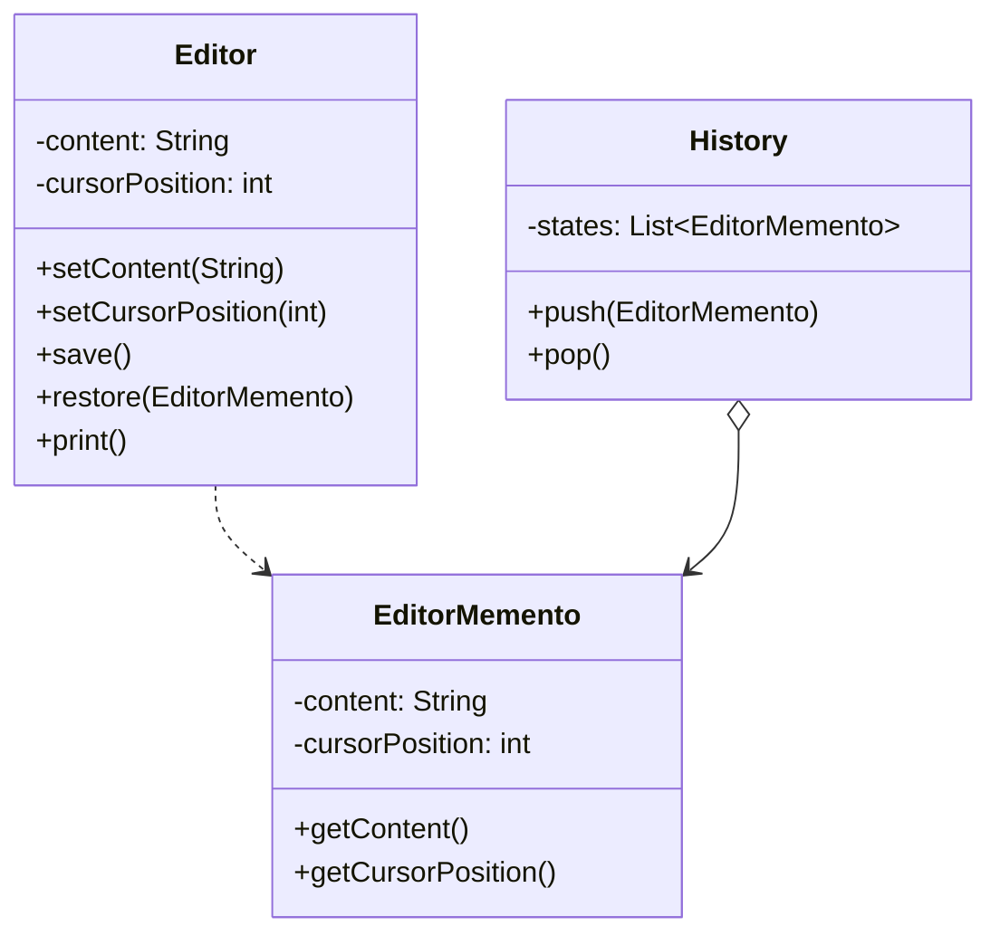

# Memento Design Pattern

## Definition
The Memento Pattern allows you to capture and restore an object's internal state without violating encapsulation. It provides the ability to restore an object to its previous state (undo via rollback).

## Key Points
1. Captures object's internal state
2. Preserves encapsulation
3. Supports undo mechanism
4. Maintains state history
5. Externalized state management

## Example Implementation
```java
// Memento class
class EditorMemento {
    private final String content;
    private final int cursorPosition;
    
    public EditorMemento(String content, int cursorPosition) {
        this.content = content;
        this.cursorPosition = cursorPosition;
    }
    
    public String getContent() {
        return content;
    }
    
    public int getCursorPosition() {
        return cursorPosition;
    }
}

// Originator class
class Editor {
    private String content;
    private int cursorPosition;
    
    public void setContent(String content) {
        this.content = content;
    }
    
    public void setCursorPosition(int position) {
        this.cursorPosition = position;
    }
    
    public EditorMemento save() {
        return new EditorMemento(content, cursorPosition);
    }
    
    public void restore(EditorMemento memento) {
        this.content = memento.getContent();
        this.cursorPosition = memento.getCursorPosition();
    }
    
    public void print() {
        System.out.println("Content: " + content);
        System.out.println("Cursor Position: " + cursorPosition);
    }
}

// Caretaker class
class History {
    private List<EditorMemento> states = new ArrayList<>();
    
    public void push(EditorMemento state) {
        states.add(state);
    }
    
    public EditorMemento pop() {
        if (!states.isEmpty()) {
            int lastIndex = states.size() - 1;
            EditorMemento lastState = states.get(lastIndex);
            states.remove(lastIndex);
            return lastState;
        }
        return null;
    }
}
```

## Class Diagram


## Benefits
1. **Encapsulation**: Preserves encapsulation boundaries
2. **Simplifies Originator**: Originator focused on business logic
3. **Easy Recovery**: Simple mechanism for state restoration
4. **History Management**: Maintains clean history of states
5. **Undo Support**: Native support for undo operations

## Cons/Challenges
1. **Memory Usage**: Storing states can use lots of memory
2. **Implementation Complexity**: Can be complex with deep copies
3. **Performance Impact**: Creating and storing states can be costly
4. **Garbage Collection**: Need to manage memory for old states
5. **Shared Resources**: Handling external resources in state
