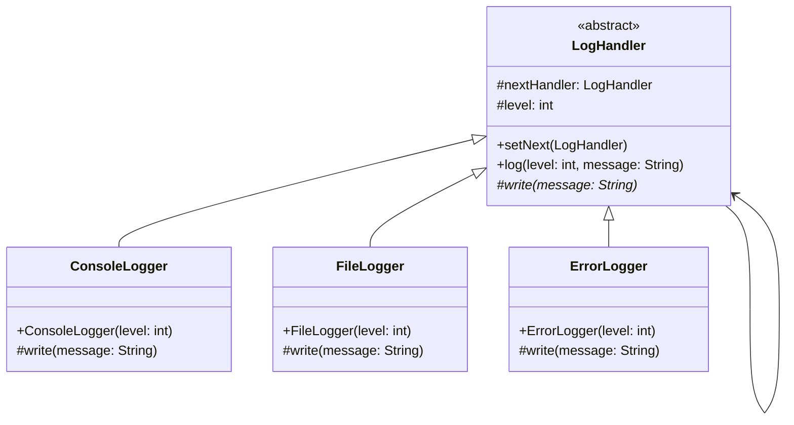

# Chain of Responsibility Design Pattern

## Definition
The Chain of Responsibility Pattern creates a chain of receiver objects for a request. This pattern decouples sender and receiver of a request based on type of request. Each receiver contains reference to another receiver. If one receiver cannot handle the request then it passes the request to the next receiver and so on.

## Key Points
1. Creates chain of receiver objects
2. Each receiver contains reference to next receiver
3. Decouples sender and receiver
4. Flexible chain composition
5. Dynamic handling of requests

## Example Implementation
```java
// Abstract handler
abstract class LogHandler {
    protected LogHandler nextHandler;
    protected int level;
    
    public void setNext(LogHandler handler) {
        this.nextHandler = handler;
    }
    
    public void log(int level, String message) {
        if (this.level <= level) {
            write(message);
        }
        if (nextHandler != null) {
            nextHandler.log(level, message);
        }
    }
    
    abstract protected void write(String message);
}

// Concrete handlers
class ConsoleLogger extends LogHandler {
    public ConsoleLogger(int level) {
        this.level = level;
    }
    
    @Override
    protected void write(String message) {
        System.out.println("Console Logger: " + message);
    }
}

class FileLogger extends LogHandler {
    public FileLogger(int level) {
        this.level = level;
    }
    
    @Override
    protected void write(String message) {
        System.out.println("File Logger: " + message);
    }
}

class ErrorLogger extends LogHandler {
    public ErrorLogger(int level) {
        this.level = level;
    }
    
    @Override
    protected void write(String message) {
        System.out.println("Error Logger: " + message);
    }
}

// Usage
class LoggerChain {
    public static LogHandler getChainOfLoggers() {
        LogHandler errorLogger = new ErrorLogger(3);
        LogHandler fileLogger = new FileLogger(2);
        LogHandler consoleLogger = new ConsoleLogger(1);
        
        errorLogger.setNext(fileLogger);
        fileLogger.setNext(consoleLogger);
        
        return errorLogger;
    }
}
```

## Class Diagram


## Benefits
1. **Decoupling**: Separates senders from receivers
2. **Flexibility**: Dynamic chain composition
3. **Single Responsibility**: Each handler focuses on one task
4. **Open/Closed**: New handlers can be added easily
5. **Loose Coupling**: Objects in chain have minimal knowledge of each other

## Cons/Challenges
1. **No Guarantee**: Request might not be handled
2. **Breaking Chain**: Might break chain by not calling next handler
3. **Complexity**: Debug and monitor chain execution
4. **Performance**: Long chains can impact performance
5. **Order Dependency**: Chain order affects processing
