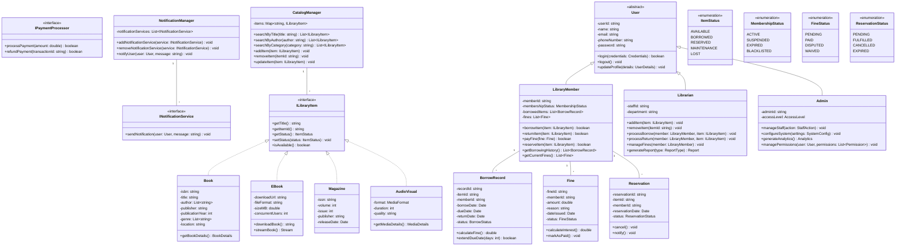

# Library Management System - UML Class Diagram

```mermaid
classDiagram

%% Abstract Classes and Interfaces
class ILibraryItem {
    <<interface>>
    +getTitle() string
    +getItemId() string
    +getStatus() ItemStatus
    +setStatus(status: ItemStatus) void
    +isAvailable() boolean
}

class INotificationService {
    <<interface>>
    +sendNotification(user: User, message: string) void
}

class IPaymentProcessor {
    <<interface>>
    +processPayment(amount: double) boolean
    +refundPayment(transactionId: string) boolean
}

%% Base Classes
class User {
    <<abstract>>
    -userId: string
    -name: string
    -email: string
    -phoneNumber: string
    -password: string
    +login(credentials: Credentials) boolean
    +logout() void
    +updateProfile(details: UserDetails) void
}

%% User Types
class LibraryMember {
    -memberId: string
    -membershipStatus: MembershipStatus
    -borrowedItems: List~BorrowRecord~
    -fines: List~Fine~
    +borrowItem(item: ILibraryItem) boolean
    +returnItem(item: ILibraryItem) boolean
    +payFine(fine: Fine) boolean
    +reserveItem(item: ILibraryItem) boolean
    +getBorrowingHistory() List~BorrowRecord~
    +getCurrentFines() List~Fine~
}

class Librarian {
    -staffId: string
    -department: string
    +addItem(item: ILibraryItem) void
    +removeItem(itemId: string) void
    +processBorrow(member: LibraryMember, item: ILibraryItem) void
    +processReturn(member: LibraryMember, item: ILibraryItem) void
    +manageFines(member: LibraryMember) void
    +generateReport(type: ReportType) Report
}

class Admin {
    -adminId: string
    -accessLevel: AccessLevel
    +manageStaff(action: StaffAction) void
    +configureSystem(settings: SystemConfig) void
    +generateAnalytics() Analytics
    +managePermissions(user: User, permissions: List~Permission~) void
}

%% Library Items
class Book {
    -isbn: string
    -title: string
    -author: List~string~
    -publisher: string
    -publicationYear: int
    -genre: List~string~
    -location: string
    +getBookDetails() BookDetails
}

class EBook {
    -downloadUrl: string
    -fileFormat: string
    -sizeMB: double
    -concurrentUsers: int
    +downloadBook() string
    +streamBook() Stream
}

class Magazine {
    -issn: string
    -volume: int
    -issue: int
    -publisher: string
    -releaseDate: Date
}

class AudioVisual {
    -format: MediaFormat
    -duration: int
    -quality: string
    +getMediaDetails() MediaDetails
}

%% Supporting Classes
class BorrowRecord {
    -recordId: string
    -itemId: string
    -memberId: string
    -borrowDate: Date
    -dueDate: Date
    -returnDate: Date
    -status: BorrowStatus
    +calculateFine() double
    +extendDueDate(days: int) boolean
}

class Fine {
    -fineId: string
    -memberId: string
    -amount: double
    -reason: string
    -dateIssued: Date
    -status: FineStatus
    +calculateInterest() double
    +markAsPaid() void
}

class Reservation {
    -reservationId: string
    -itemId: string
    -memberId: string
    -reservationDate: Date
    -status: ReservationStatus
    +cancel() void
    +notify() void
}

class NotificationManager {
    -notificationServices: List~INotificationService~
    +addNotificationService(service: INotificationService) void
    +removeNotificationService(service: INotificationService) void
    +notifyUser(user: User, message: string) void
}

class CatalogManager {
    -items: Map~string, ILibraryItem~
    +searchByTitle(title: string) List~ILibraryItem~
    +searchByAuthor(author: string) List~ILibraryItem~
    +searchByCategory(category: string) List~ILibraryItem~
    +addItem(item: ILibraryItem) void
    +removeItem(itemId: string) void
    +updateItem(item: ILibraryItem) void
}

%% Relationships
User <|-- LibraryMember
User <|-- Librarian
User <|-- Admin

ILibraryItem <|.. Book
ILibraryItem <|.. EBook
ILibraryItem <|.. Magazine
ILibraryItem <|.. AudioVisual

LibraryMember "1" -- "*" BorrowRecord
LibraryMember "1" -- "*" Fine
LibraryMember "1" -- "*" Reservation

CatalogManager "1" -- "*" ILibraryItem
NotificationManager "1" -- "*" INotificationService

%% Enums
class ItemStatus {
    <<enumeration>>
    AVAILABLE
    BORROWED
    RESERVED
    MAINTENANCE
    LOST
}

class MembershipStatus {
    <<enumeration>>
    ACTIVE
    SUSPENDED
    EXPIRED
    BLACKLISTED
}

class FineStatus {
    <<enumeration>>
    PENDING
    PAID
    DISPUTED
    WAIVED
}

class ReservationStatus {
    <<enumeration>>
    PENDING
    FULFILLED
    CANCELLED
    EXPIRED
}
```
