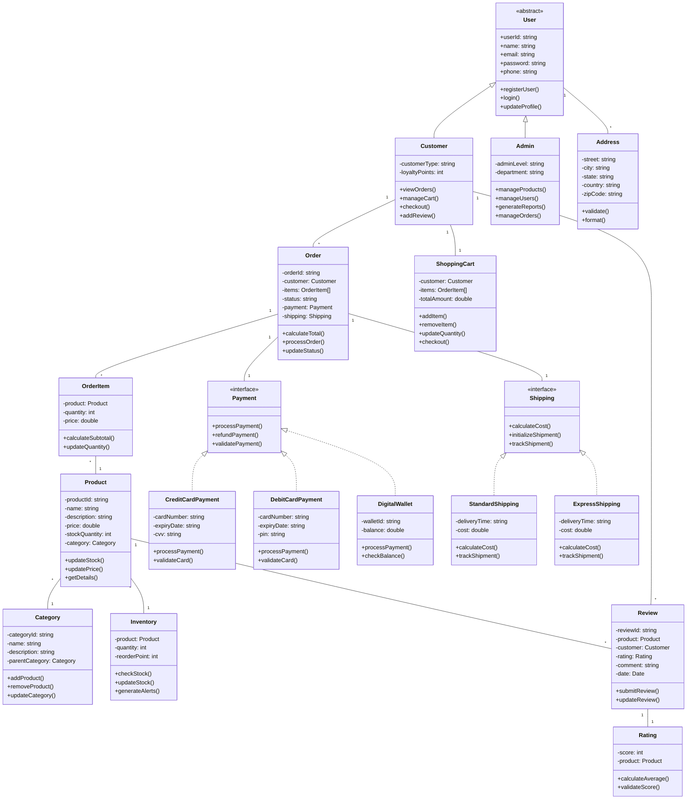

# E-Commerce System Class Diagram

```mermaid
classDiagram

    %% Abstract Classes and Interfaces
    class User {
        <<abstract>>
        +userId: string
        +name: string
        +email: string
        +password: string
        +phone: string
        +registerUser()
        +login()
        +updateProfile()
    }

    class Payment {
        <<interface>>
        +processPayment()
        +refundPayment()
        +validatePayment()
    }

    class Shipping {
        <<interface>>
        +calculateCost()
        +initializeShipment()
        +trackShipment()
    }

    %% User Management
    class Customer {
        -customerType: string
        -loyaltyPoints: int
        +viewOrders()
        +manageCart()
        +checkout()
        +addReview()
    }

    class Admin {
        -adminLevel: string
        -department: string
        +manageProducts()
        +manageUsers()
        +generateReports()
        +manageOrders()
    }

    %% Product Management
    class Product {
        -productId: string
        -name: string
        -description: string
        -price: double
        -stockQuantity: int
        -category: Category
        +updateStock()
        +updatePrice()
        +getDetails()
    }

    class Category {
        -categoryId: string
        -name: string
        -description: string
        -parentCategory: Category
        +addProduct()
        +removeProduct()
        +updateCategory()
    }

    class Inventory {
        -product: Product
        -quantity: int
        -reorderPoint: int
        +checkStock()
        +updateStock()
        +generateAlerts()
    }

    %% Order Management
    class Order {
        -orderId: string
        -customer: Customer
        -items: OrderItem[]
        -status: string
        -payment: Payment
        -shipping: Shipping
        +calculateTotal()
        +processOrder()
        +updateStatus()
    }

    class OrderItem {
        -product: Product
        -quantity: int
        -price: double
        +calculateSubtotal()
        +updateQuantity()
    }

    class ShoppingCart {
        -customer: Customer
        -items: OrderItem[]
        -totalAmount: double
        +addItem()
        +removeItem()
        +updateQuantity()
        +checkout()
    }

    %% Payment Classes
    class CreditCardPayment {
        -cardNumber: string
        -expiryDate: string
        -cvv: string
        +processPayment()
        +validateCard()
    }

    class DebitCardPayment {
        -cardNumber: string
        -expiryDate: string
        -pin: string
        +processPayment()
        +validateCard()
    }

    class DigitalWallet {
        -walletId: string
        -balance: double
        +processPayment()
        +checkBalance()
    }

    %% Shipping Classes
    class StandardShipping {
        -deliveryTime: string
        -cost: double
        +calculateCost()
        +trackShipment()
    }

    class ExpressShipping {
        -deliveryTime: string
        -cost: double
        +calculateCost()
        +trackShipment()
    }

    class Address {
        -street: string
        -city: string
        -state: string
        -country: string
        -zipCode: string
        +validate()
        +format()
    }

    %% Review System
    class Review {
        -reviewId: string
        -product: Product
        -customer: Customer
        -rating: Rating
        -comment: string
        -date: Date
        +submitReview()
        +updateReview()
    }

    class Rating {
        -score: int
        -product: Product
        +calculateAverage()
        +validateScore()
    }

    %% Relationships
    User <|-- Customer
    User <|-- Admin
    Payment <|.. CreditCardPayment
    Payment <|.. DebitCardPayment
    Payment <|.. DigitalWallet
    Shipping <|.. StandardShipping
    Shipping <|.. ExpressShipping
    
    Customer "1" -- "1" ShoppingCart
    Customer "1" -- "*" Order
    Customer "1" -- "*" Review
    Order "1" -- "*" OrderItem
    OrderItem "*" -- "1" Product
    Product "1" -- "*" Review
    Product "*" -- "1" Category
    Product "1" -- "1" Inventory
    Order "1" -- "1" Payment
    Order "1" -- "1" Shipping
    User "1" -- "*" Address
    Review "1" -- "1" Rating
```
