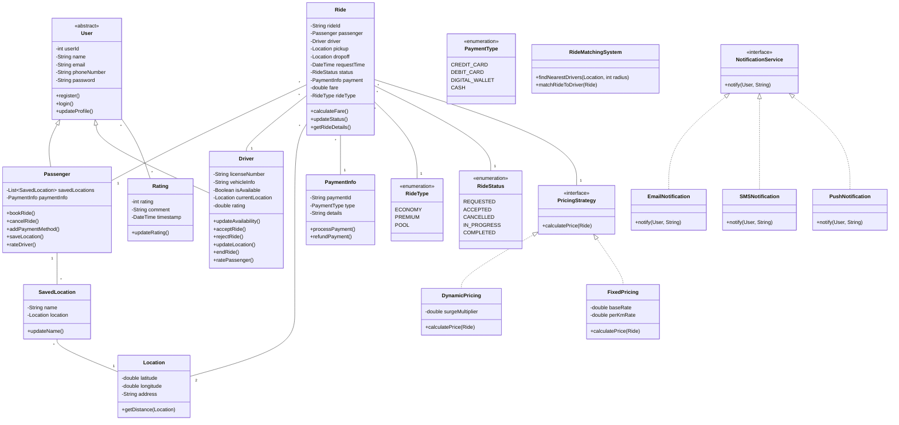

# Ride Sharing System - UML Class Diagram

```mermaid
classDiagram

    %% User Management
    class User {
        <<abstract>>
        -int userId
        -String name
        -String email
        -String phoneNumber
        -String password
        +register()
        +login()
        +updateProfile()
    }

    class Passenger {
        -List~SavedLocation~ savedLocations
        -PaymentInfo paymentInfo
        +bookRide()
        +cancelRide()
        +addPaymentMethod()
        +saveLocation()
        +rateDriver()
    }

    class Driver {
        -String licenseNumber
        -String vehicleInfo
        -Boolean isAvailable
        -Location currentLocation
        -double rating
        +updateAvailability()
        +acceptRide()
        +rejectRide()
        +updateLocation()
        +endRide()
        +ratePassenger()
    }

    %% Location Management
    class Location {
        -double latitude
        -double longitude
        -String address
        +getDistance(Location)
    }

    class SavedLocation {
        -String name
        -Location location
        +updateName()
    }

    %% Ride Management
    class Ride {
        -String rideId
        -Passenger passenger
        -Driver driver
        -Location pickup
        -Location dropoff
        -DateTime requestTime
        -RideStatus status
        -PaymentInfo payment
        -double fare
        -RideType rideType
        +calculateFare()
        +updateStatus()
        +getRideDetails()
    }

    class RideType {
        <<enumeration>>
        ECONOMY
        PREMIUM
        POOL
    }

    class RideStatus {
        <<enumeration>>
        REQUESTED
        ACCEPTED
        CANCELLED
        IN_PROGRESS
        COMPLETED
    }

    %% Payment Management
    class PaymentInfo {
        -String paymentId
        -PaymentType type
        -String details
        +processPayment()
        +refundPayment()
    }

    class PaymentType {
        <<enumeration>>
        CREDIT_CARD
        DEBIT_CARD
        DIGITAL_WALLET
        CASH
    }

    %% Rating System
    class Rating {
        -int rating
        -String comment
        -DateTime timestamp
        +updateRating()
    }

    %% Pricing Strategy (Strategy Pattern)
    class PricingStrategy {
        <<interface>>
        +calculatePrice(Ride)
    }

    class DynamicPricing {
        -double surgeMultiplier
        +calculatePrice(Ride)
    }

    class FixedPricing {
        -double baseRate
        -double perKmRate
        +calculatePrice(Ride)
    }

    %% Matching System
    class RideMatchingSystem {
        +findNearestDrivers(Location, int radius)
        +matchRideToDriver(Ride)
    }

    %% Notifications (Observer Pattern)
    class NotificationService {
        <<interface>>
        +notify(User, String)
    }

    class EmailNotification {
        +notify(User, String)
    }

    class SMSNotification {
        +notify(User, String)
    }

    class PushNotification {
        +notify(User, String)
    }

    %% Relationships
    User <|-- Passenger
    User <|-- Driver
    Passenger "1" -- "*" SavedLocation
    SavedLocation "*" -- "1" Location
    Ride "*" -- "1" Passenger
    Ride "*" -- "1" Driver
    Ride "*" -- "2" Location
    Ride "*" -- "1" PaymentInfo
    Ride "*" -- "1" RideType
    Ride "*" -- "1" RideStatus
    Ride "*" -- "1" PricingStrategy
    PricingStrategy <|.. DynamicPricing
    PricingStrategy <|.. FixedPricing
    NotificationService <|.. EmailNotification
    NotificationService <|.. SMSNotification
    NotificationService <|.. PushNotification
    User "*" -- "*" Rating
```
