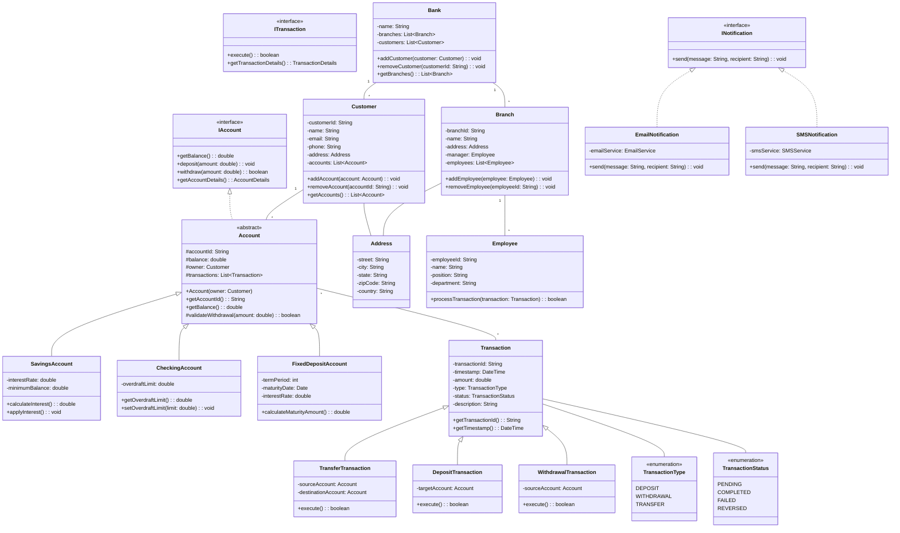

# Banking System - UML Class Diagram

```mermaid
classDiagram

    %% Interfaces
    class IAccount {
        <<interface>>
        +getBalance(): double
        +deposit(amount: double): void
        +withdraw(amount: double): boolean
        +getAccountDetails(): AccountDetails
    }

    class ITransaction {
        <<interface>>
        +execute(): boolean
        +getTransactionDetails(): TransactionDetails
    }

    class INotification {
        <<interface>>
        +send(message: String, recipient: String): void
    }

    %% Abstract Classes
    class Account {
        <<abstract>>
        #accountId: String
        #balance: double
        #owner: Customer
        #transactions: List~Transaction~
        +Account(owner: Customer)
        +getAccountId(): String
        +getBalance(): double
        #validateWithdrawal(amount: double): boolean
    }

    %% Concrete Classes
    class SavingsAccount {
        -interestRate: double
        -minimumBalance: double
        +calculateInterest(): double
        +applyInterest(): void
    }

    class CheckingAccount {
        -overdraftLimit: double
        +getOverdraftLimit(): double
        +setOverdraftLimit(limit: double): void
    }

    class FixedDepositAccount {
        -termPeriod: int
        -maturityDate: Date
        -interestRate: double
        +calculateMaturityAmount(): double
    }

    class Customer {
        -customerId: String
        -name: String
        -email: String
        -phone: String
        -address: Address
        -accounts: List~Account~
        +addAccount(account: Account): void
        +removeAccount(accountId: String): void
        +getAccounts(): List~Account~
    }

    class Address {
        -street: String
        -city: String
        -state: String
        -zipCode: String
        -country: String
    }

    class Transaction {
        -transactionId: String
        -timestamp: DateTime
        -amount: double
        -type: TransactionType
        -status: TransactionStatus
        -description: String
        +getTransactionId(): String
        +getTimestamp(): DateTime
    }

    class TransferTransaction {
        -sourceAccount: Account
        -destinationAccount: Account
        +execute(): boolean
    }

    class DepositTransaction {
        -targetAccount: Account
        +execute(): boolean
    }

    class WithdrawalTransaction {
        -sourceAccount: Account
        +execute(): boolean
    }

    class Bank {
        -name: String
        -branches: List~Branch~
        -customers: List~Customer~
        +addCustomer(customer: Customer): void
        +removeCustomer(customerId: String): void
        +getBranches(): List~Branch~
    }

    class Branch {
        -branchId: String
        -name: String
        -address: Address
        -manager: Employee
        -employees: List~Employee~
        +addEmployee(employee: Employee): void
        +removeEmployee(employeeId: String): void
    }

    class Employee {
        -employeeId: String
        -name: String
        -position: String
        -department: String
        +processTransaction(transaction: Transaction): boolean
    }

    class EmailNotification {
        -emailService: EmailService
        +send(message: String, recipient: String): void
    }

    class SMSNotification {
        -smsService: SMSService
        +send(message: String, recipient: String): void
    }

    %% Enums
    class TransactionType {
        <<enumeration>>
        DEPOSIT
        WITHDRAWAL
        TRANSFER
    }

    class TransactionStatus {
        <<enumeration>>
        PENDING
        COMPLETED
        FAILED
        REVERSED
    }

    %% Relationships
    IAccount <|.. Account
    Account <|-- SavingsAccount
    Account <|-- CheckingAccount
    Account <|-- FixedDepositAccount
    Customer "1" -- "*" Account
    Customer -- Address
    Transaction <|-- TransferTransaction
    Transaction <|-- DepositTransaction
    Transaction <|-- WithdrawalTransaction
    Account "*" -- "*" Transaction
    Bank "1" -- "*" Branch
    Bank "1" -- "*" Customer
    Branch -- Address
    Branch "1" -- "*" Employee
    INotification <|.. EmailNotification
    INotification <|.. SMSNotification
    Transaction -- TransactionType
    Transaction -- TransactionStatus
```
