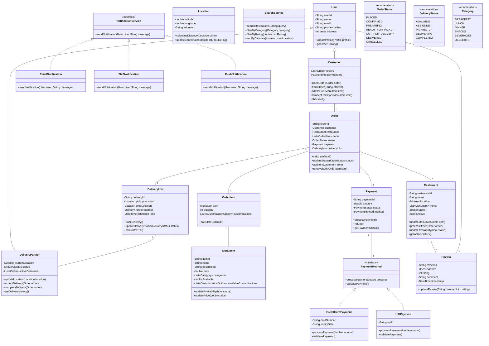

# Food Delivery System - Class Diagram

```mermaid
classDiagram

    %% User Management
    class User {
        -String userId
        -String name
        -String email
        -String phoneNumber
        -Address address
        +updateProfile(Profile profile)
        +getOrderHistory()
    }

    class Customer {
        -List~Order~ orders
        -PaymentInfo paymentInfo
        +placeOrder(Order order)
        +trackOrder(String orderId)
        +addToCart(MenuItem item)
        +removeFromCart(MenuItem item)
        +checkout()
    }

    class DeliveryPartner {
        -Location currentLocation
        -DeliveryStatus status
        -List~Order~ activeDeliveries
        +updateLocation(Location location)
        +acceptDelivery(Order order)
        +completeDelivery(Order order)
        +getDeliveryHistory()
    }

    class Restaurant {
        -String restaurantId
        -String name
        -Address location
        -List~MenuItem~ menu
        -double rating
        -bool isActive
        +updateMenu(MenuItem item)
        +processOrder(Order order)
        +updateAvailability(bool status)
        +getActiveOrders()
    }

    %% Order Management
    class Order {
        -String orderId
        -Customer customer
        -Restaurant restaurant
        -List~OrderItem~ items
        -OrderStatus status
        -Payment payment
        -DeliveryInfo deliveryInfo
        +calculateTotal()
        +updateStatus(OrderStatus status)
        +addItem(OrderItem item)
        +removeItem(OrderItem item)
    }

    class OrderItem {
        -MenuItem item
        -int quantity
        -List~CustomizationOption~ customizations
        +calculateSubtotal()
    }

    class MenuItem {
        -String itemId
        -String name
        -String description
        -double price
        -List~Category~ categories
        -bool isAvailable
        -List~CustomizationOption~ availableCustomizations
        +updateAvailability(bool status)
        +updatePrice(double price)
    }

    %% Payment System
    class Payment {
        -String paymentId
        -double amount
        -PaymentStatus status
        -PaymentMethod method
        +processPayment()
        +refund()
        +getPaymentStatus()
    }

    class PaymentMethod {
        <<interface>>
        +processPayment(double amount)
        +validatePayment()
    }

    class CreditCardPayment {
        -String cardNumber
        -String expiryDate
        +processPayment(double amount)
        +validatePayment()
    }

    class UPIPayment {
        -String upiId
        +processPayment(double amount)
        +validatePayment()
    }

    %% Delivery Management
    class DeliveryInfo {
        -String deliveryId
        -Location pickupLocation
        -Location dropLocation
        -DeliveryPartner partner
        -DateTime estimatedTime
        +trackDelivery()
        +updateDeliveryStatus(DeliveryStatus status)
        +calculateETA()
    }

    class Location {
        -double latitude
        -double longitude
        -String address
        +calculateDistance(Location other)
        +updateCoordinates(double lat, double lng)
    }

    %% Rating System
    class Review {
        -String reviewId
        -User reviewer
        -int rating
        -String comment
        -DateTime timestamp
        +updateReview(String comment, int rating)
    }

    %% Search and Filtering
    class SearchService {
        +searchRestaurants(String query)
        +filterByCategory(Category category)
        +filterByRating(double minRating)
        +sortByDistance(Location userLocation)
    }

    %% Notifications
    class NotificationService {
        <<interface>>
        +sendNotification(User user, String message)
    }

    class EmailNotification {
        +sendNotification(User user, String message)
    }

    class SMSNotification {
        +sendNotification(User user, String message)
    }

    class PushNotification {
        +sendNotification(User user, String message)
    }

    %% Enums and Value Objects
    class OrderStatus {
        <<enumeration>>
        PLACED
        CONFIRMED
        PREPARING
        READY_FOR_PICKUP
        OUT_FOR_DELIVERY
        DELIVERED
        CANCELLED
    }

    class DeliveryStatus {
        <<enumeration>>
        AVAILABLE
        ASSIGNED
        PICKING_UP
        DELIVERING
        COMPLETED
    }

    class Category {
        <<enumeration>>
        BREAKFAST
        LUNCH
        DINNER
        SNACKS
        BEVERAGES
        DESSERTS
    }

    %% Relationships
    User <|-- Customer
    User <|-- DeliveryPartner
    Customer "1" -- "*" Order
    Order "*" -- "1" Restaurant
    Order "1" -- "*" OrderItem
    OrderItem "*" -- "1" MenuItem
    Order "1" -- "1" Payment
    Order "1" -- "1" DeliveryInfo
    DeliveryInfo "1" -- "1" DeliveryPartner
    Payment "1" -- "1" PaymentMethod
    PaymentMethod <|.. CreditCardPayment
    PaymentMethod <|.. UPIPayment
    NotificationService <|.. EmailNotification
    NotificationService <|.. SMSNotification
    NotificationService <|.. PushNotification
    Restaurant "1" -- "*" Review
    User "1" -- "*" Review
```
